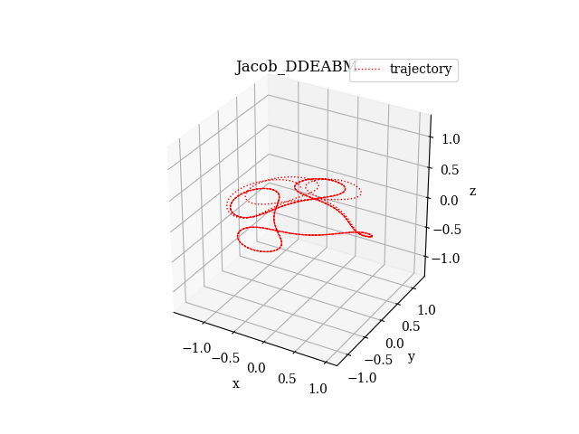
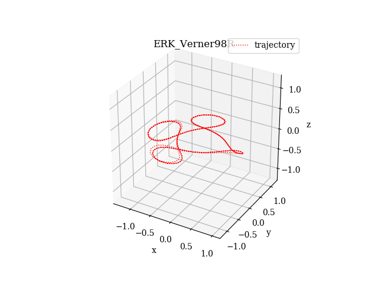

# FLINT

## Fortran Library for numerical INTegration of differential equations

[](https://travis-ci.com/princemahajan/FLINT) 

### Author

Bharat Mahajan

### Copyright

Copyright 2019 Bharat Mahajan <br><br>
This work was performed at Odyssey Space Research LLC, Houston, TX as part of
the work under contract no. 80JSC017D0001 with NASA-Johnson Space Center. 
FLINT source code is licensed under the Apache License, Version 2.0 (the "License")
found in LICENSE file contained in this distribution. <br><br>
The coefficients for DOP853 method were derived by Ernest Hairer. 
His original codes are available at http://www.unige.ch/~hairer/software.html. 
The coefficients for Verner65E and Verner98R methods were derived by Jim Verner, and 
are available at http://people.math.sfu.ca/~jverner/.    

### Introduction

FLINT is a modern object-oriented Fortran library that provides four adaptive step-size explicit Runge-Kutta (ERK) methods of order 5, 6, 8, and 9 along with dense-output and event-detection support for each of the methods. The code is written such that any other ERK method can be  implemented by including its coefficients with minimum changes required in the code. The DOP853 integrator is the default method chosen, and its implementation is hand-optimized specific to its coefficients. For other integrators, a generic routine for step-integration is implemented. This generic routine supports both FSAL and non-FSAL methods. Dense output is supported with delayed interpolation. When interpolation is enabled, FLINT computes the interpolation coefficients during the integration and stores them in its internal memory. After that, the interpolation method can be used any number of times to find the solution values at any user-specified grid within the initial and final points used during the integration. Interpolation is much faster than integration in FLINT, as the coefficients are all precomputed during the integration. Multiple event detection is supported for each integrator along with event-masking (static and dynamic), event-direction, and termination options. Additionally, a step-size for event detection is also supported. In a nutshell, the features are:

- Modern object-oriented, thread-safe, and optimized Fortran code
- 4 Explicit Runge-Kutta (ERK) integrators: DOP54, DOP853, Verner98R, Verner65E (as of now)
- Any ERK method can be implemented by just including their coefficients
- Dense output with delayed interpolation (integrate once, interpolate as many times)
- Multiple event-detection with event masking and separate event step-size
- Stiffness detection

User specifies the differential equations and events function in a separate class and their interfaces are provided. See the test program TestFLINT and the DiffEq module on how to use FLINT.

### Installation

FLINT is tested with ifort (18.0.2) compiler from Intel Parallel Studio XE Composer for Windows 2016 integrated with Microsoft Visual Studio Community version 2017. Some testing is also done with gfortran on Windows and Linux plaforms. Doxyfile is provided for generating extensive API documentation using Doxygen. FLINT has no dependency on any other library. The CMakeLists file is provided to generate Visual Studio projects or makefiles on Windows and Linux using cmake. Additionally, it also generates cmake config files to easily link FLINT using the find_package() command. The steps to link FLINT in cmake-based projects are:

+ In cmake GUI or command-line, set FLINT_INSTALL_LIB_DIR to the desired directory, where the compiled library, modules, and cmake config files will be installed.
+ In cmake GUI or command-line, set FLINT_INSTALL_BIN_DIR to the desired directory, where the compiled test executables of FLINT will be installed.
+ In your project CMakeLists.txt, insert
    ```cmake
        find_package(FLINT REQUIRED 0.9 CONFIG 
            PATHS "<SAME_PATH_AS_IN_FLINT_INSTALL_LIB_DIR>")
        target_link_libraries(<YOUR_TARGET_NAME> FLINT::FLINT)
    ```

### How to Use

1. Create a differential equation system class by providing differential equation function, events function (if any), and parameters (if any).

```fortran
    use FLINT
    implicit none

    type, extends(DiffEqSys) :: TBSys
        real(WP) :: GM = 398600.436233_WP  ! parameter constant
    contains
        procedure :: F => TwoBodyDE     ! Differential equations
        procedure :: G => SampleEventTB ! events, use only if needed
    end type TBSys

    contains

    pure function TwoBodyDE(me, X, Y, Params)
        implicit none
        class(TBSys), intent(in) :: me !< Differential Equation object
        real(WP), intent(in) :: X
        real(WP), intent(in), dimension(:) :: Y
        real(WP), intent(in), dimension(:), optional :: Params
        real(WP), dimension(size(Y)) :: TwoBodyDE

        TwoBodyDE(1:3) = Y(4:6)
        TwoBodyDE(4:6) = -me%GM/(norm2(Y(1:3))**3)*Y(1:3) ! Two-body orbit diffeq
    end function TwoBodyDE

    pure subroutine SampleEventTB(me, EventID, X, Y, Value, Direction, Terminal)
        implicit none
        class(TBSys), intent(in) :: me !< Differential Equation object            
        integer, intent(in) :: EventID        
        real(WP), intent(in) :: X
        real(WP), dimension(:), intent(in) :: Y
        real(WP), dimension(:), intent(out) :: Value
        integer, dimension(size(Value)), intent(out) :: Direction
        logical, dimension(size(Value)), intent(out) :: Terminal

        Value(1) = Y(2) ! detect y-crossing
        Value(2) = Y(1) ! detect x-crossing    

        Direction(1) = 1  ! detect -ve to +ve transitions for y coordinate
        Direction(2) = -1 ! detect +ve to -ve transitions for x coordinate
        Terminal = [.FALSE., .FALSE.] ! continue integration after events
    end subroutine SampleEventTB      
```

2. Initialize the differential equation and ERK class objects for using Runge-Kutta intgerators.

```fortran
        use FLINT

        type(ERK_class) ::  erk
        type(TBSys)     :: diffeq
        
        diffeq%n = 6        ! Number of 1st-order differential equations
        diffeq%m = 2        ! Number of events
        
        ! Initialize the ERK object for 10000 max steps, DOP54 method with abs. tol. 1e-12, rel. tol. 1e-9
        ! and turn on interpolation and events detection    
        call erk%Init(diffeq, 10000, Method=ERK_DOP54, ATol=[1e-12], RTol=[1e-9],&
        InterpOn=.TRUE.,EventsOn=.TRUE.)
```

3. Call the Integrate subroutine for performing the integration if init was successful. Note if interpolation is enabled, then the IntStepsOn option for computing the states at integrator's natural step-size must not be set to True.

```fortran
    integer :: stiffstatus    
    real(WP) :: x0, xf    
    real(WP), dimension(6) :: y0, yf
    real(WP), allocatable, dimension(:,:) :: EventData ! allocated by Integrate
    
    stiffstatus = 1 ! detect stiffness and terminate if equations are stiff    
    x0 = 0.0    
    y0 = [6400.0_wp,0.0_wp,0.0_WP, 0.0_WP,7.69202528825512_WP,7.69202528825512_WP]
    xf = 161131.68239305308_WP      
    
    ! Call Intgerate with final solution in yf, no initial step-size given, events-related
    ! data (event-id, x value, y state) in EventData, and all events are detected
    if (erk%status == FLINT_SUCCESS) then    
        call erk%Integrate(x0, y0, xf, yf, StepSz=0.0, IntStepsOn=.FALSE.,&
        EventStates=EventData, EventMask = [.TRUE.,.TRUE.],StiffTest=stiffstatus)
    end if    
```

4. Call the Interpolate function for computing solution on the desired grid of x values. The last parameter must be specified as True if user wants FLINT to keep the internal storage for calling Interpolate again. Otherwise, the internal storage is deleted and the user must intgerate the equations again before calling Interpolate.

```fortran      
    real(WP), dimension(:), allocatable :: Xarr1, Xarr2
    real(WP), dimension(6,:) :: Yarr1, Yarr2
    
    Xarr1 = [(x0 + (xf-x0)/10*i, i=0,9)]    ! grid-1 with 10 points
    Xarr2 = [(x0 + (xf-x0)/1000*i, i=0,999)]    ! grid-2 with 1000 points
    allocate(Yarr1(6,size(Xarr1)))    ! allocate solution storage
    allocate(Yarr2(6,size(Xarr2)))        
    
    if (erk%status == FLINT_SUCCESS) then
        ! interpolate and keep the internal storage for further calls
        call erk%Interpolate(Xarr1, Yarr1, .TRUE.)
        ! After this interpolation, delete the internal storage (default).
        call erk%Interpolate(Xarr2, Yarr2, .FALSE.) 
    end if    
    
    ! print the solutions
    print *, 'Solution at grid-1'    
    print *, Yarr1
    print *, 'Solution at grid-2'        
    print *, Yarr2
    ! print the event data
    print *, EventData(1,:)     ! Time at which events occured
    print *, EventData(2:7,:)   ! corresponding position and velocity states
    print *, Eventdata(8,:)     ! Event-ID number
```  

For all the FLINT status codes and options supported by Init, Integrate, and Interpolate procedures along with the interfaces for user-supplied functions, see the FLINT_base module in FLINT_base.f90 file. 

### Testing

In all the tests, the orbit is propagated for 4 orbital periods and the integration is repeated 5000 times. The tables give the total time for 5000 propagations and all other testing parameters are given for each integration. The relative tolerance is taken as 1e-11 and absolute tolerance as 1e-14 in all the cases except when explicitly mentioned otherwise. Interpolation is used to capture 1000 points per orbit period. Note that the delayed interpolation feature of FLINT is not used in these results.    

The initial conditions in Cartesian coodinates used are as follows:
- Two-Body circular Earth orbit  (Units: km, sec)
    + GM: 398600.436233     
    + Y0 = [6400.0,0.0,0.0, 0.0,5.58037857139,5.58037857139] 
- Two-Body elliptic Earth orbit  (Units: km, sec)
    + GM: 398600.436233     
    + Y0 = [6400.0,0.0,0.0,0.0,7.69202528825512,7.69202528825512]
- Arenstorf orbit in rotating frame  (Units: nondimensional)
    + mass-ratio: 0.012277471
    + time-period: 17.0652165601579625588917206249    
    + Y0 = [0.994, 0.0, 0.0_wp, -2.00158510637908252240537862224]

Note that JDOP853 and JDDEABM are modern fortran implementations of DOP853 and DDEABM by Jacob Williams, and are available at https://github.com/jacobwilliams. The plots are generated using https://github.com/jacobwilliams/pyplot-fortran.

- Two-Body circular Earth orbit

|Params\Integrator | DOP54   | DOP853 | Verner65E | Verner98R | JDOP853  | JDDEABM |
|----------------- | ------- | ------ | --------- | --------- | -------  | --------------|
|Closing Error     | 6.3e-6  | 4.3e-7 |   2.7e-6  |    1.1e-7 |  4.3e-7  |   3.1e-6         |  
|IOM Error         | 3.1e-11 | 3.1e-11|   3.1e-11 |   3.1e-11 |  3.1e-11 |   3.9e-10        |       
|Time (s)          |    2.42  | **0.42**   |   1.91    |    0.87   |  1.42    |   **0.62**  |         
|Func Calls        |  7889   | 1886   |   6043    |    2218   |  1886    |   734           |
|Accepted Steps    |   1302  | 157    |   749     |    131    |  157     |   365           |
|Rejected Steps    |     15  | 0      |   7       |    8      |  0       |   NA           |

- Two-Body circular Earth orbit with interpolation

|Params\Integrator | DOP54   | DOP853 | Verner65E | Verner98R | JDOP853  | JDDEABM
|----------------- | ------- | ------ | --------- | --------- | -------  | --------------
|Closing Error     | 6.3e-6  | 4.3e-7 |   2.7e-6  |    1.1e-7 |  4.3e-7  |   3.1e-6           
|IOM Error         | 3.1e-11 | 3.1e-11|   3.1e-11 |   3.1e-11 |  3.1e-11 |   3.9e-10               
|Time (s)          |    6.3  | **4.3**    |   6.6     |    5.7    |  127.1   |   **5.1**           
|Func Calls        |  7889   | 2357   |   6792    |    2873   |  2336    |   734           
|Accepted Steps    |   1302  | 157    |   749     |    131    |  157     |   NA           
|Rejected Steps    |     15  | 0      |   7       |    8      |  0       |   NA           

- Two-Body elliptic Earth orbit  

|Params\Integrator | DOP54   | DOP853  | Verner65E | Verner98R | JDOP853  | JDDEABM
|----------------- | ------- | ------  | --------- | --------- | -------  | --------------
|Closing Error     | 2.7     | 2.7     |   2.7     |    2.7    |  2.7     |   2.7           
|IOM Error         | 6.7e-10 | 6.7e-10 |   6.7e-10 |   6.7e-10 |  6.7e-10 |   2.3e-9               
|Time (s)          |    4.8    | **1.3**    |   3.6    |    2.43   |  3.9     |   **3.2**           
|Func Calls        |  15409  | 6227    |   11520   |    6223   |  6227    |   3325           
|Accepted Steps    |   2552  | 428     |   1431    |    296    |  428     |   1648           
|Rejected Steps    |     19  | 99      |   10      |    99     |  99      |   NA         

- Two-Body elliptic Earth orbit with interpolation

|Params\Integrator | DOP54   | DOP853  | Verner65E | Verner98R | JDOP853  | JDDEABM
|----------------- | ------- | ------  | --------- | --------- | -------  | --------------
|Closing Error     | 2.7     | 2.7     |   2.7     |    2.7    |  2.7     |   2.7           
|IOM Error         | 6.7e-10 | 6.7e-10 |   6.7e-10 |   6.7e-10 |  6.7e-10 |   2.3e-9               
|Time (s)          |    10.7 | **6.0** |   10.5     |    8.6   |  130    |   **8.3**           
|Func Calls        |  15409  | 7511    |   12951   |    7703   |  7397    |   3325           
|Accepted Steps    |   2552  | 428     |   1431    |    296    |  428     |   4000           
|Rejected Steps    |     19  | 99      |   10      |    99      |  99      |   NA         

- Arenstorf orbit

|Params\Integrator | DOP54   | DOP853  | Verner65E | Verner98R | JDOP853  | JDDEABM
|----------------- | ------- | ------  | --------- | --------- | -------  | --------------
|Closing Error     | 1.7     | 0.33    |   0.33    |    0.31   |  0.33    |   0.23           
|IOM Error         | 7.2e-11 | 7.2e-11 |   7.2e-11 |   7.2e-11 |  7.2e-11 |   9.4e-11               
|Time (s)          |    14.8 | **3.6**    |   10.7   |    6.3    |  12.9   |   **7.9**           
|Func Calls        |  44847  | 15816   |   32337   |    15344  |  15816   |   8202           
|Accepted Steps    |   7425  | 1074    |   4006    |    792    |  1074    |   4071           
|Rejected Steps    |     59  | 266     |   41      |    178    |  266     |   NA           

- Arenstorf orbit with interpolation

|Params\Integrator | DOP54   | DOP853  | Verner65E | Verner98R | JDOP853  | JDDEABM
|----------------- | ------- | ------  | --------- | --------- | -------  | --------------
|Closing Error     | 1.7     | 0.33     |   0.33     |    0.31 |  0.33     |   0.23           
|IOM Error         | 9.4e-11 | 7.1e-11 |   7.1e-11 |   7.1e-11 |  7.2e-11 |   9.4e-11               
|Time (s)          |    29  | **10.8** |   26.4     |    16.4  |  136    |   **12.4**           
|Func Calls        |  44847  | 19038   |   36343   |    19304  |  18315   |   9904           
|Accepted Steps    |   7425  | 1074    |   4006    |    792    |  1074    |   4000           
|Rejected Steps    |     59  | 266     |   41      |    178    |  266    |   NA           

For relative tol=1e-9 and abs tol=1e-12, the Arenstorf orbit propagated for 4 periods by JDOP853, JDDEABM and FLINT's Verner98R are shown below. Verner98R diverges much slower than DOP853 and DDEABM for this orbit and tolerance values.

 
 
 

The following figure shows the multiple event detection capability of FLINT, in which the X-crossings in decreasing and Y-crossings in increasing direction are detected and reported to the user.


### References

- Hairer, Ernst, Norsett, Syvert P., Wanner, Gerhard, Solving Ordinary Differential Equations I, Springer-Verlag Berlin Heidelberg, 2nd Ed., 1993.    
