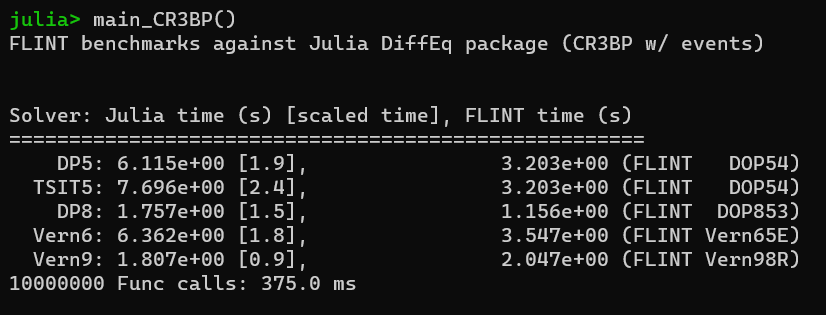

# FLINT


## Fortran Library for numerical INTegration of differential equations


### Author

Bharat Mahajan


### Copyright

Copyright 2024 Bharat Mahajan <br><br>
The initial code was written by Bharat Mahajan at Odyssey Space Research LLC, Houston, TX as part of
the work under contract no. 80JSC017D0001 with NASA-Johnson Space Center. 
FLINT source code is licensed under the Apache License, Version 2.0 (the "License")
found in LICENSE file contained in this distribution. <br><br>
The coefficients for DOP853 method were derived by Ernest Hairer. 
His original codes are available at http://www.unige.ch/~hairer/software.html. 
The coefficients for Verner65E and Verner98R methods were derived by Jim Verner, and 
are available at http://people.math.sfu.ca/~jverner/.    


### Introduction

FLINT is a modern object-oriented Fortran library that provides four adaptive step-size explicit Runge-Kutta (ERK) methods of order 5, 6, 8, and 9 along with dense-output and multiple event-detection support for each of the methods. The code is written such that any other ERK method can be implemented by including its coefficients with minimum changes required in the code. The DOP54 and DOP853 integrators step implementation is hand-optimized and for other integrators, a generic routine for step integration enables quick inclusion of new ERK methods. This generic step integration routine supports both FSAL and non-FSAL methods. Dense output is supported with delayed interpolation. When interpolation is enabled, FLINT computes the interpolation coefficients during the integration and stores them in internal memory. Thereafter, the interpolation method can be used any number of times to find the solution values at any user-specified grid within the initial and final conditions. Interpolation is performed much faster than integration as the coefficients are all precomputed during the integration. Multiple event detection is supported for each integrator along with many features such as event root-finding, event step-size, event actions. In a nutshell, the features are:
                  
+ Modern object-oriented, thread-safe, and optimized Fortran code
+ 4 Adaptive-step ERK integrators: DOP54, DOP853, Verner98R, Verner65E
+ Fixed step size for integration is supported as well as the ability to propagate for a single step and return control to the user 
+ Any other ERK method can be implemented by including their coefficients
+ Dense output with delayed interpolation (integrate once, interpolate as many times)
+ Multiple event-detection as well as finding location of events using root-finding  (Brent's algorithm) with static and dynamic event masking
+ Ability to set a maximum delay (referred to here as event step-size) after which events are guaranteed to be detected
+ Ability to restart the integration or change solution on the detection of events
+ Stiffness detection

The following figure shows the multiple event detection capability of FLINT, in which the X-crossings in decreasing and Y-crossings in increasing directions of a three-body orbit are detected by FLINT.


### Performance Benchmarks

The latest FLINT code (compiled using Intel Fortran compiler ifort) is tested against Julia's (ver 1.10.0) DifferentialEquations package ver 7.12.0 (https://diffeq.sciml.ai/stable/) for different problems with and without event detection. The Julia test code along with results are provided in the tests folder in FLINT's GitHub repository https://github.com/princemahajan/FLINT. Benchmark charts are provided in the media folder.

+ Work-Precision Data for Three-Body problem (No events)


+ Three-Body problem propagation (w/ events)



+ Lorenz equations integration (w/o events)


### Installation

FLINT is tested with ifort (2021.11.1) and gfortran (11.4.0) compilers. Doxyfile is provided for generating extensive API documentation using Doxygen. FLINT has no dependency on any other library. The CMakeLists and a FPM (https://github.com/fortran-lang/fpm) toml files are provided to generate build and install files on Windows and Linux. An example to build the project along with the test programs with double precision using cmake is

```
cmake -B ./build -DCMAKE_INSTALL_PREFIX=<INSTALL_DIR_PATH>
cmake --build ./build
```

The option _REAL128=TRUE (as -D_REAL128=TRUE) can be provided to cmake to build the project with quad precision. For single precision, use _REAL32=TRUE. For FPM, use

```
 fpm build --flag -D_REAL128
 fpm test --flag -D_REAL128
```

Additionally, FLINT generates cmake config files to easily link it using the find_package() command when cmake is used. The steps to link FLINT in cmake-based projects are:

+ In cmake GUI or command-line, set FLINT_INSTALL_LIB_DIR to the desired directory, where the compiled library, modules, and cmake config files will be installed.
+ In cmake GUI or command-line, set FLINT_INSTALL_BIN_DIR to the desired directory, where the compiled test executables of FLINT will be installed.
+ In your project CMakeLists.txt, insert
    ```cmake
        find_package(FLINT REQUIRED 0.9 CONFIG 
            PATHS "<SAME_PATH_AS_IN_FLINT_INSTALL_LIB_DIR>")
        target_link_libraries(<YOUR_TARGET_NAME> FLINT::FLINT)
    ```


### How to Use

See the test codes in [tests](https://github.com/princemahajan/FLINT/tree/master/tests) folder. Following are the steps in brief for a demo problem:

1. Create a differential equation system class by providing differential equation function, events function (if any), and parameters (if any).

```fortran
    use FLINT, WP => FLINT_WP
    implicit none

    type, extends(DiffEqSys) :: TBSys
        real(WP) :: GM = 398600.436233_WP  ! parameter constant
    contains
        procedure :: F => TwoBodyDE     ! Differential equations
        procedure :: G => SampleEventTB ! events, use only if needed
    end type TBSys

    contains

    function TwoBodyDE(me, X, Y, Params)
        implicit none
        class(TBSys), intent(in) :: me !< Differential Equation object
        real(WP), intent(in) :: X
        real(WP), intent(in), dimension(:) :: Y
        real(WP), intent(in), dimension(:), optional :: Params
        real(WP), dimension(size(Y)) :: TwoBodyDE

        TwoBodyDE(1:3) = Y(4:6)
        TwoBodyDE(4:6) = -me%GM/(norm2(Y(1:3))**3)*Y(1:3) ! Two-body orbit diffeq
    end function TwoBodyDE

    subroutine SampleEventTB(me, X, Y, EvalEvents, Value, Direction, LocEvent, LocEventAction)
        implicit none
        class(TBSys), intent(in) :: me !< Differential Equation object            
        real(WP), intent(in) :: X
        real(WP), dimension(:), intent(inout) :: Y
        integer, dimension(:), intent(in) :: EvalEvents
        real(WP), dimension(:), intent(out) :: Value
        integer, dimension(:), intent(out) :: Direction
        integer, intent(in), optional :: LocEvent
        integer(kind(FLINT_EVENTACTION_CONTINUE)), intent(out), optional :: LocEventAction

        if (EvalEvents(1)==1) Value(1) = Y(2) ! detect y-crossing
        if (EvalEvents(2)==1) Value(2) = Y(1) ! detect x-crossing    

        Direction(1) = 1  ! detect -ve to +ve transitions for y coordinate
        Direction(2) = -1 ! detect +ve to -ve transitions for x coordinate

        ! Set actions for each event if located
        if (present(LocEvent) .AND. present(LocEventAction)) then
            if (LocEvent == 1) then
                LocEventAction = IOR(FLINT_EVENTACTION_CONTINUE, &
                    FLINT_EVENTACTION_MASK)
            else if (LocEvent == 2) then
                ! Mask the event-2 after first trigger            
                LocEventAction = IOR(FLINT_EVENTACTION_CONTINUE, &
                        FLINT_EVENTACTION_MASK)
            end if   
        end if
    end subroutine SampleEventTB  
```

2. Initialize the differential equation and ERK class objects for using Runge-Kutta integrators.

```fortran
        use FLINT

        type(ERK_class) ::  erk
        type(TBSys)     :: diffeq
        
        diffeq%n = 6        ! Number of 1st-order differential equations
        diffeq%m = 2        ! Number of events
        
        ! Initialize the ERK object for 10000 max steps, DOP54 method with abs. tol. 1e-12, rel. tol. 1e-9
        ! and turn on interpolation and events detection    
        call erk%Init(diffeq, 10000, Method=ERK_DOP54, ATol=[1e-12], RTol=[1e-9],&
        InterpOn=.TRUE.,EventsOn=.TRUE.)
```

3. Call the Integrate subroutine for performing the integration if init was successful. Note if interpolation is enabled, then the IntStepsOn option for computing the states at integrator's natural step-size must not be set to True.

```fortran
    integer :: stiffstatus    
    real(WP) :: x0, xf    
    real(WP), dimension(6) :: y0, yf
    real(WP), allocatable, dimension(:,:) :: EventData ! allocated by Integrate
    
    stiffstatus = 1 ! detect stiffness and terminate if equations are stiff    
    x0 = 0.0    
    y0 = [6400.0_wp,0.0_wp,0.0_WP, 0.0_WP,7.69202528825512_WP,7.69202528825512_WP]
    xf = 161131.68239305308_WP      
    
    ! Call Intgerate with final solution in yf, no initial step-size given, events-related
    ! data (event-id, x value, y state) in EventData, and all events are detected
    if (erk%status == FLINT_SUCCESS) then    
        call erk%Integrate(x0, y0, xf, yf, StepSz=0.0, IntStepsOn=.FALSE.,&
        EventStates=EventData, EventMask = [.TRUE.,.TRUE.],StiffTest=stiffstatus)
    end if    
```

4. Call the Interpolate function for computing solution on the desired grid of x values. The last parameter must be specified as True if user wants FLINT to keep the internal storage for calling Interpolate again. Otherwise, the internal storage is deleted and the user must integrate the equations again before calling Interpolate.

```fortran      
    real(WP), dimension(:), allocatable :: Xarr1, Xarr2
    real(WP), dimension(6,:) :: Yarr1, Yarr2
    
    Xarr1 = [(x0 + (xf-x0)/10*i, i=0,9)]    ! grid-1 with 10 points
    Xarr2 = [(x0 + (xf-x0)/1000*i, i=0,999)]    ! grid-2 with 1000 points
    allocate(Yarr1(6,size(Xarr1)))    ! allocate solution storage
    allocate(Yarr2(6,size(Xarr2)))        
    
    if (erk%status == FLINT_SUCCESS) then
        ! interpolate and keep the internal storage for further calls
        call erk%Interpolate(Xarr1, Yarr1, .TRUE.)
        ! After this interpolation, delete the internal storage (default).
        call erk%Interpolate(Xarr2, Yarr2, .FALSE.) 
    end if    
    
    ! print the solutions
    print *, 'Solution at grid-1'    
    print *, Yarr1
    print *, 'Solution at grid-2'        
    print *, Yarr2
    ! print the event data
    print *, EventData(1,:)     ! Time at which events occured
    print *, EventData(2:7,:)   ! corresponding position and velocity states
    print *, Eventdata(8,:)     ! Event-ID number
```  

For all the FLINT status codes and options supported by Init, Integrate, and Interpolate procedures along with the interfaces for user-supplied functions, see the docs and/or [FLINT_base](https://github.com/princemahajan/FLINT/blob/master/src/FLINT_base.f90) module. 


### References

- Hairer, Ernst, Norsett, Syvert P., Wanner, Gerhard, Solving Ordinary Differential Equations I, Springer-Verlag Berlin Heidelberg, 2nd Ed., 1993.    
